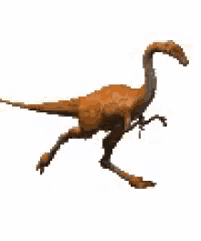
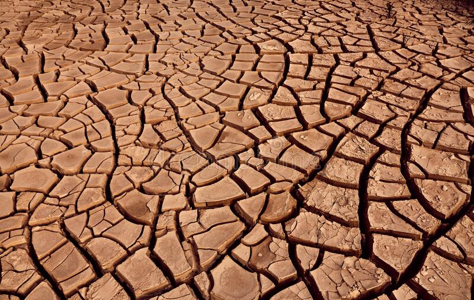

# How to Make RTX Chrome Dino Game

## Step 1 - Choose Assets

Choose your assets and store them in your folder with your HTML file. You will need a dinosaur (`dinosaur-walk.gif`), a cactus (`cactus.png`) and ground (`ground.jpg`).

## Step 2 - Write Basic HTML Layout

```html
<!DOCTYPE html>
<html lang="en">
<head>
    <meta charset="UTF-8">
    <meta http-equiv="X-UA-Compatible" content="IE=edge">
    <meta name="viewport" content="width=device-width, initial-scale=1.0">
    <title>Daniel's Dino DJ</title>
    <style>
        body{
            margin: 0px;
        }
    </style>
</head>
<body>
    <h1></h1>
    
    
    
    <div id="things">

    </div>
    <script>
        const dino = document.querySelector('#dino');
        const ground = document.querySelector('#ground');
        const ground2 = document.querySelector('#ground2');
        let Y = 0;
        let Yvelocity = 0;
        let X = 0;
        const cacti = [];
        let debug = false;
    </script>
</body>
</html>
```

## Step 3 - Create Scrolling Background

Add This to your CSS:

```css

        .ground{
            position: fixed;
            object-fit: cover;
            height: auto;
            width: 100%;
        }
        #ground2{
            transform: scaleX(-1);
        }
```

And add this to you JavaScript:

```js

function tick(){
            dino.style.translate = `0% calc( -100% - ${Y}vh)`;
            ground.style.left = ((X-100)%200)+100 + 'vw';
            ground2.style.left = (X%200)+100 + 'vw';
            X = X-0.2;
            setTimeout(tick, 0);
        }
        tick();
```

## Step 4 - Add Obstacles

Add this to your CSS:

```css
        .cactus{
            position: fixed;
            top: 50%;
            translate: 0% -50%;
            z-index: 101;
            filter: drop-shadow(2vw 4vw 6vw #002202);
            width: 9vw;
            height: auto;
        }

```

Add This To Your JavaScript:

```js


        function createThings(){
            const newThing = document.createElement('img');
            newThing.src = './cactus.png';
            newThing.className = 'cactus';
            newThing.style.right = '0vw';
            document.querySelector('#things').appendChild(newThing);
            cacti.push(newThing);
        }
        
        function spawnCactus(){
            createThings();
            setTimeout(spawnCactus, Math.random()*1500+1000)
        }
        spawnCactus()
```

Put this at the bottom of the `tick` function:

```js
            for(cactus of cacti){
                let currentX = parseFloat(cactus.style.right.replace('vw', ''));
                if(currentX > 110){
                    cacti.splice(cacti.indexOf(cactus), 0);
                    cactus.remove();
                    continue;
                }
                currentX = currentX + 0.2;
                cactus.style.right = currentX + 'vw';

            }
```


You should now have this:

```html
<!DOCTYPE html>
<html lang="en">
<head>
    <meta charset="UTF-8">
    <meta http-equiv="X-UA-Compatible" content="IE=edge">
    <meta name="viewport" content="width=device-width, initial-scale=1.0">
    <title>Daniel's Dino DJ</title>
    <style>
        body{
            margin: 0px;
        }
        .ground{
            position: fixed;
            object-fit: cover;
            height: auto;
            width: 100%;
        }
        #ground2{
            transform: scaleX(-1);
        }
        .cactus{
            position: fixed;
            top: 50%;
            translate: 0% -50%;
            z-index: 101;
            filter: drop-shadow(2vw 4vw 6vw #002202);
            width: 9vw;
            height: auto;
        }
    </style>
</head>
<body>
    
    
    
    <div id="things">

    </div>
    <script>
        const dino = document.querySelector('#dino');
        const ground = document.querySelector('#ground');
        const ground2 = document.querySelector('#ground2');
        let Y = 0;
        let Yvelocity = 0;
        const cacti = [];
        let debug = false;
        let X = 0;
        function tick(){
            dino.style.translate = `0% calc( -100% - ${Y}vh)`;
            ground.style.left = ((X-100)%200)+100 + 'vw';
            ground2.style.left = (X%200)+100 + 'vw';
            X = X-0.2;
            for(cactus of cacti){
                let currentX = parseFloat(cactus.style.right.replace('vw', ''));
                if(currentX > 110){
                    cacti.splice(cacti.indexOf(cactus), 0);
                    cactus.remove();
                    continue;
                }
                currentX = currentX + 0.2;
                cactus.style.right = currentX + 'vw';

            }
            setTimeout(tick, 0);
        }
        tick();

        function createThings(){
            const newThing = document.createElement('img');
            newThing.src = './cactus.png';
            newThing.className = 'cactus';
            newThing.style.right = '0vw';
            document.querySelector('#things').appendChild(newThing);
            cacti.push(newThing);
        }

        function spawnCactus(){
            createThings();
            setTimeout(spawnCactus, Math.random()*1500+1000)
        }
        spawnCactus()
    </script>
</body>
</html>
```

## Step 5 - Make Dinosaur Jump

Add this to your JavaScript: 

```js
        function jump(){
            Yvelocity = 4.5;
        };
        document.body.addEventListener('keydown', () =>{
            jump()
        })
        
        document.body.addEventListener('mousedown', () =>{
            jump()
        });
```

Put this at the bottom of the `tick` function:

```js

            Y = Y+Yvelocity;
            if(Yvelocity > 0){
            Yvelocity = Yvelocity*0.9
            }else{
                Yvelocity = Yvelocity*1.2
            }
            if(Y > 0.1 && Yvelocity < 0.1) Yvelocity = -0.4
            if(Y < 0.1){
                Yvelocity = 0
            }

```

Put this in your CSS: 

```css

        #dino{
            position: fixed;
            top: 50%;
            z-index: 100;
            border-radius: 2rem;
            left: 10vw;
        }

```

## Step 6 - Death

Add this to your `for` loop in the `tick` function: 

```js
// use debug = true to prevent death
                if((currentX > 75 && currentX < 85 ) && Y < 15 && !debug){
                    document.write('You failed idiot!')
                }
```


Your `tick` function should now look like this: 

```js

        function tick(){
            dino.style.translate = `0% calc( -100% - ${Y}vh)`;
            ground.style.left = ((X-100)%200)+100 + 'vw';
            ground2.style.left = (X%200)+100 + 'vw';
            X = X-0.2;
            for(cactus of cacti){
                let currentX = parseFloat(cactus.style.right.replace('vw', ''));
                if(currentX > 110){
                    cacti.splice(cacti.indexOf(cactus), 0);
                    cactus.remove();
                    continue;
                }
                currentX = currentX + 0.2;
                cactus.style.right = currentX + 'vw';
                if((currentX > 75 && currentX < 85 ) && Y < 15 && !debug){
                    document.write('You failed idiot!')
                }

            }
            Y = Y+Yvelocity;
            if(Yvelocity > 0){
            Yvelocity = Yvelocity*0.9
            }else{
                Yvelocity = Yvelocity*1.2
            }
            if(Y > 0.1 && Yvelocity < 0.1) Yvelocity = -0.4
            if(Y < 0.1){
                Yvelocity = 0
            }
            setTimeout(tick, 0);
        }
        tick();
```
